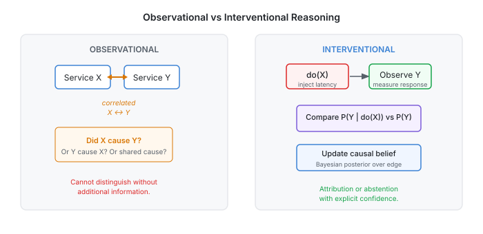

# RIFT — Intervention-Grounded Detection of Behavioral Divergence

RIFT is a research prototype for investigating whether controlled runtime interventions
can improve causal attribution of behavioral divergence in distributed microservice systems.
Standard observational telemetry shows *what changed together*; RIFT attempts to answer
*what caused what* by combining causal discovery, explicit do-calculus intervention semantics,
divergence analysis, and iterative Bayesian graph updates into one closed-loop pipeline.

> **Status:** Research implementation complete. Mac-side validation: 624 tests passing.
> Final Linux / live-system empirical evaluation: **pending** (VM temporarily unavailable).
> See [Current Status](#current-status) for the precise breakdown.

---

## At a Glance

<p align="center">
  
</p>

RIFT moves from raw telemetry through causal graph discovery, identifiability checking,
cost-aware intervention selection, real network injection, divergence measurement, and
closed-loop model update — producing either a root-cause attribution with explicit confidence,
or a principled abstention when causal identification is not possible.

---

## The Core Research Question

<p align="center">
  
</p>

Observational RCA correlates metrics and ranks services by anomaly score.
RIFT tests whether deliberately perturbing one service (via `tc netem`) and
measuring the downstream response provides signal that pure observation cannot.
When a hidden confounder makes two services appear correlated without a direct
causal link, RIFT detects the non-identifiability and abstains — rather than
producing a silent false attribution.

---

## Research Questions

| RQ | Question |
|----|----------|
| **RQ1** | Does controlled intervention improve root-cause attribution accuracy compared to observational ranking? |
| **RQ2** | Can identifiability analysis (via PAG) detect when causal attribution is not supported, and correctly abstain? |
| **RQ3** | Does cost-aware intervention selection (MSIS) reduce disruption compared to random selection while maintaining attribution quality? |
| **RQ4** | Does iterative closed-loop graph update outperform one-shot intervention on multi-cause faults? |

Hypotheses H1–H4 correspond directly to RQ1–RQ4. Experiment registry: [`experiments/REGISTRY.yaml`](experiments/REGISTRY.yaml).

---

## System Components

| Component | Location | Purpose |
|-----------|----------|---------|
| **FCI / PAG** | `src/rift/fci/` | Causal discovery from time-series telemetry; produces Partial Ancestral Graph |
| **Anomaly subgraph** | `src/rift/graph/` | Identify diverging services (Strategy D expansion) |
| **Identifiability** | `src/rift/identifiability/` | Backdoor / frontdoor / IV check — gates attribution |
| **EBD** | `src/rift/ebd/` | Earliest Behavioral Divergence — R1–R4 evidence criteria |
| **CID** | `src/rift/cid/` | Causal Intervention Divergence — Wasserstein W1 pre/post shift |
| **MSIS** | `src/rift/optimizer/` | Minimum-Surprise Intervention Selector — greedy cost minimisation |
| **Intervention engine** | `src/rift/intervention/` | `tc netem` per-destination latency/loss injection (Linux) |
| **Safety controller** | `src/rift/safety/` | 8 hard stops (kill switch, production namespace, budget, blast radius…) |
| **Closed-loop** | `src/rift/loop/` | Beta posterior update over edge confidence; iterative Bayesian refinement |
| **Baselines** | `src/rift/baselines/` | RIFT-OBS, RIFT-RANDOM, RIFT-ONE-SHOT, SIEVE-LIKE, ORACLE |
| **Evaluation** | `src/rift/evaluation/` | Attribution metrics, divergence metrics, EBD metrics, power analysis |
| **Statistics** | `src/rift/statistics/` | Wilcoxon, TOST, binomial, Holm-Bonferroni, BH-FDR |

---

## Experimental Setup

<p align="center">
  
</p>

**Testbed:** [Online Boutique](https://github.com/GoogleCloudPlatform/microservices-demo) v0.9.0 —
14 containerised microservices on an isolated Docker bridge network.
No production data; no real user traffic.

**Fault injection:** `tc netem` latency / packet-loss injection with per-destination `u32` filters.
Requires Linux `CAP_NET_ADMIN`. Each fault scenario has a frozen seed, ground-truth causal path,
and rollback validation.

**Observability:** Prometheus (metrics), Jaeger (distributed traces), OTel Collector (OTLP bridge).

**Scenario benchmark:**

| Split | Scenarios | Confounded | Multi-cause |
|-------|-----------|-----------|-------------|
| Development | 50 | 24 | 12 |
| Validation | 18 | 24 | — |
| **Held-out** *(sealed)* | **15** | — | — |
| **Total** | **83** | **48** | **12+** |

**Baselines:** RIFT-OBS (observation only), RIFT-RANDOM (random intervention order),
RIFT-ONE-SHOT (single intervention, no closed-loop update), SIEVE-LIKE (observational anomaly ranking —
*methodological reimplementation, not the original Sieve system*), ORACLE (ground-truth PAG upper bound).

---

## Current Status

```
Research implementation     COMPLETE
Mac-side validation         624 tests passing / 0 failing
Linux environment           PASS  (RHEL 9.6, Docker 29.7.2, tc/netem confirmed)
Online Boutique testbed     PASS  (14/14 containers healthy)
Safety hard stops           PASS  (all 8 validated on Linux)
tc/netem injection          PASS  (200 ms latency, rollback, isolation confirmed)
Live telemetry pipeline     PENDING  (PrometheusClient.collect() + OTel wiring)
Live fault injection        PENDING  (tc band fix — T3 — ready, awaiting re-run)
Full live E2E (RIFT-FULL)   PENDING
H1 / H2 / H3 / H4          PENDING
Held-out evaluation         SEALED / PENDING
Paper                       IN PREPARATION
```

The implementation and reproducibility infrastructure are complete.
Final empirical results require one more Linux execution campaign after three
known blockers (T1: Prometheus client, T2: OTel wiring, T3: tc band index) are
deployed. These fixes are implemented and Mac-tested; see [`docs/PHASE_4_LINUX_EXECUTION_REPORT.md`](docs/PHASE_4_LINUX_EXECUTION_REPORT.md).

### Synthetic development-set results *(not final publication results)*

These numbers are from the pre-Linux synthetic benchmark (oracle PAG, mock telemetry).
They must not be interpreted as live-system performance.

| Metric | Value | Notes |
|--------|-------|-------|
| Raw Precision@1 | 50% | 36-scenario dev set, oracle PAG, synthetic |
| Conditional Precision@1 | 60% | Excludes NOT_IDENTIFIABLE confounded scenarios |
| Correct abstention rate | 100% | All 24 confounded scenarios correctly abstained |

---

## Reproduction

### Requirements

- Python 3.11
- Docker 24+ and Docker Compose v2 (for testbed)
- Linux with `CAP_NET_ADMIN` (for live intervention; Mac runs synthetic mode)

### Quick start

```bash
# 1. Clone
git clone https://github.com/ManasSakthivel/RIFT-Intervention-Grounded-Detection-of-Behavioral-Divergence.git
cd RIFT-Intervention-Grounded-Detection-of-Behavioral-Divergence

# 2. Install dependencies
python3.11 -m pip install -r requirements.txt

# 3. Run full test suite (Mac/Linux — no testbed required)
python3.11 -m pytest tests/ -q
# Expected: 624 passed

# 4. Run development validation
make reproduce-all

# 5. List available experiments
python3.11 -m rift.experiments.run --list

# 6. Run a single experiment (dry-run mode on Mac)
make experiment EXP=EXP-001
```

### Linux testbed (live mode)

```bash
# Requires Linux with Docker and CAP_NET_ADMIN
./scripts/start_testbed.sh
./scripts/health_check_testbed.sh
make experiment EXP=EXP-001   # runs with live_telemetry_used=True
```

### Generate figures and tables

```bash
python3.11 analysis/run_analysis.py
# Output: analysis/figures/, analysis/tables/
```

---

## Research Documentation

| Document | Purpose |
|----------|---------|
| [`docs/hypotheses.md`](docs/hypotheses.md) | H1–H4 formal hypotheses |
| [`experiments/REGISTRY.yaml`](experiments/REGISTRY.yaml) | All 14 registered experiments |
| [`docs/CLAIMS_REGISTRY.yaml`](docs/CLAIMS_REGISTRY.yaml) | Evidence-to-claim mapping (13 claims) |
| [`docs/formal_model.md`](docs/formal_model.md) | Formal RIFT model specification |
| [`docs/ebd_definition.md`](docs/ebd_definition.md) | EBD R1–R4 criteria definition |
| [`docs/intervention_semantics.md`](docs/intervention_semantics.md) | do-calculus intervention model |
| [`docs/causal_assumptions.md`](docs/causal_assumptions.md) | Causal assumptions and violations |
| [`docs/safety_model.md`](docs/safety_model.md) | Safety controller design |
| [`docs/baselines/`](docs/baselines/) | Baseline specifications |
| [`docs/reproduction/REPRODUCIBILITY_AUDIT.md`](docs/reproduction/REPRODUCIBILITY_AUDIT.md) | Reproducibility audit |
| [`docs/PHASE_4_LINUX_EXECUTION_REPORT.md`](docs/PHASE_4_LINUX_EXECUTION_REPORT.md) | Linux Phase 4 execution report |
| [`artifacts/FINAL_PRE_LINUX_FREEZE.json`](artifacts/FINAL_PRE_LINUX_FREEZE.json) | Frozen state manifest |

---

## Limitations

- **Controlled testbed only.** RIFT is evaluated on Online Boutique — a purpose-built
  demonstration application with 10–14 services. Generalisation to larger or real production
  systems is not yet established.
- **Synthetic fault benchmark.** Fault scenarios are constructed by the authors.
  They cover representative fault classes but are not drawn from a production incident corpus.
- **Live validation pending.** Core empirical results (H1–H4) require live Linux execution
  with real Prometheus telemetry and tc/netem injection. Synthetic pre-validation results
  must not be treated as final.
- **Causal discovery limitations.** FCI assumes causal Markov condition and near-faithfulness.
  Microservice dynamics may violate faithfulness locally. Edge orientation uncertainty
  (PAG circle marks) can expand the NOT_IDENTIFIABLE set.
- **R3 leaf-node limitation.** Services that are sinks in the call-graph PAG (e.g., payment,
  product_catalog) cannot satisfy the R3 causal relevance criterion. This is a known structural
  limitation documented in [`artifacts/phase3_5/v1_decomposition.json`](artifacts/phase3_5/v1_decomposition.json).
- **SIEVE-LIKE is a methodological reimplementation.** No claim is made about the
  original Sieve system.
- **Intervention scope.** Safety constraints restrict interventions to the isolated
  `rift-eval-network`. Cross-host or production-traffic interventions are outside scope.

---

## Citation

```bibtex
@software{sakthivel2026rift,
  author  = {Sakthivel, Manas},
  title   = {{RIFT}: Intervention-Grounded Detection of Behavioral Divergence},
  year    = {2026},
  url     = {https://github.com/ManasSakthivel/RIFT-Intervention-Grounded-Detection-of-Behavioral-Divergence},
  version = {0.1.0-phase4}
}
```

Or use the [`CITATION.cff`](CITATION.cff) file.

---

## License

MIT — see [`LICENSE`](LICENSE).
Online Boutique images are Apache 2.0 (Google LLC); `causal-learn` is MIT (CMU).
The fault benchmark datasets are original research artifacts distributed under MIT.
