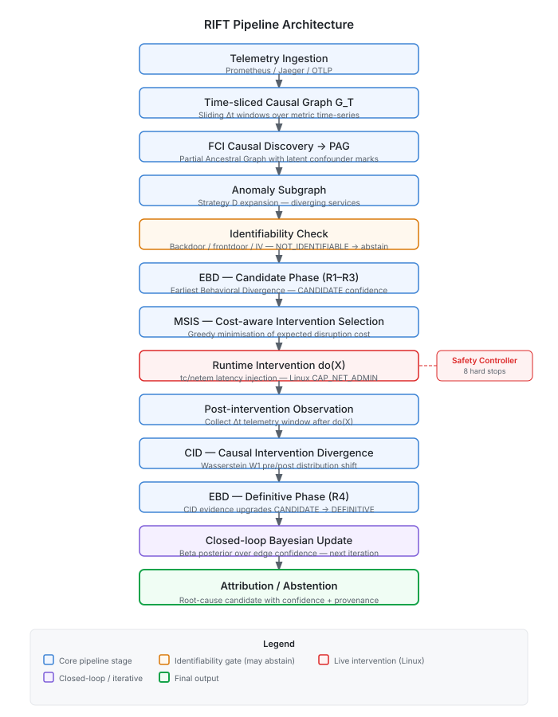
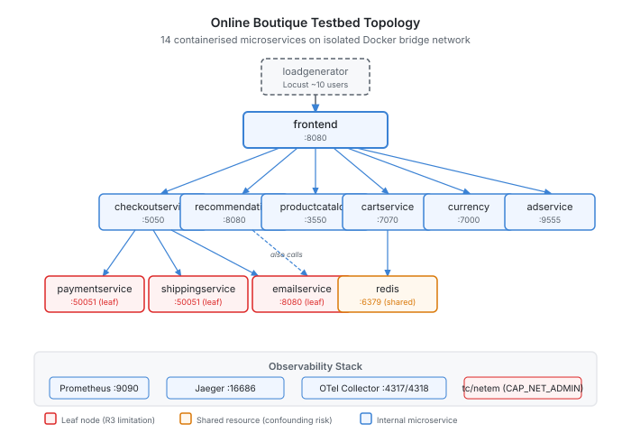

# RIFT — Intervention-Grounded Detection of Behavioral Divergence

A prototype for exploring whether controlled interventions can improve root-cause analysis in distributed microservice systems.

Standard observability (metrics, traces, logs) tells you what changed around the same time a failure occurred — it's correlation. RIFT explores whether deliberately perturbing a service — injecting latency via `tc netem` — and measuring what happens downstream gives better signal for identifying what actually *caused* the problem.

> **Status:** Implementation complete. 624 tests passing on Mac. Live empirical evaluation on the Linux testbed is pending — see [Current Status](#current-status) for the full breakdown.

---

## The idea

When service A and service B both show elevated latency, standard RCA tools rank them by anomaly score. That ranking conflates cause and effect.

RIFT runs a different query: if I inject 200ms of latency into service A and service B's latency goes up proportionally, that's evidence A causes B. If injecting into A doesn't change B, the correlation was spurious.

There's also the harder case: when a hidden shared dependency makes two services appear correlated without a direct causal link. RIFT uses a causal discovery algorithm (FCI/PAG) to detect that structure and abstain from attributing blame in those cases, rather than producing a confident wrong answer.

---

## System overview

<p align="center">
  
</p>

The pipeline:

1. **Causal discovery** — FCI runs on time-series telemetry and produces a Partial Ancestral Graph (PAG) representing possible causal structures
2. **Identifiability check** — determines whether the PAG supports a causal attribution, or whether confounding makes it ambiguous
3. **Intervention selection** — picks which service to perturb, minimizing operational disruption
4. **Injection** — `tc netem` latency/loss injection on the isolated Docker network
5. **Divergence measurement** — Wasserstein W1 distance between pre/post metric distributions
6. **Bayesian update** — updates edge confidence in the causal graph based on what the intervention revealed
7. **Attribution** — returns a root cause with confidence, or abstains if the evidence is insufficient

---

## Research questions

| RQ | Question |
|----|----------|
| RQ1 | Does controlled intervention improve root-cause attribution accuracy vs. observational ranking? |
| RQ2 | Can identifiability analysis detect when attribution isn't supported and correctly abstain? |
| RQ3 | Does cost-aware intervention selection reduce disruption vs. random selection? |
| RQ4 | Does iterative closed-loop update outperform single-shot intervention on multi-cause faults? |

These correspond to hypotheses H1–H4. None of them are confirmed yet — the live evaluation is pending.

---

## Testbed

<p align="center">
  
</p>

[Online Boutique](https://github.com/GoogleCloudPlatform/microservices-demo) v0.9.0 — 14 containerised microservices on an isolated Docker bridge network. No production data or real traffic.

Observability: Prometheus (metrics), Jaeger (traces), OTel Collector (OTLP bridge).

Fault injection: `tc netem` with per-destination `u32` filters. Requires Linux `CAP_NET_ADMIN`.

**Fault scenarios:**

| Split | Scenarios | Notes |
|-------|-----------|-------|
| Development | 50 | includes 24 confounded + 12 multi-cause |
| Validation | 18 | — |
| Held-out | 15 | sealed until final evaluation |

---

## Current status

```
Implementation                COMPLETE
Mac-side tests                624 passing / 0 failing
Linux environment             PASS (RHEL 9.6, Docker, tc/netem confirmed)
Online Boutique testbed       PASS (14/14 containers healthy)
Safety hard stops             PASS (all 8 validated)
tc/netem injection            PASS (latency injection + rollback confirmed)

Live telemetry pipeline       PENDING (Prometheus client + OTel wiring)
Full live evaluation          PENDING
H1 / H2 / H3 / H4            PENDING
Held-out evaluation           SEALED / PENDING
```

Three known blockers (Prometheus client wiring, OTel integration, tc band index) are implemented and Mac-tested; they need one more Linux deployment run.

### Development-set numbers *(synthetic, not final)*

These are from the pre-Linux synthetic benchmark using oracle PAG and mock telemetry. They don't represent live system performance.

| Metric | Value |
|--------|-------|
| Raw Precision@1 | 50% (36-scenario dev set, synthetic) |
| Conditional Precision@1 | 60% (excluding non-identifiable confounded scenarios) |
| Abstention accuracy | 100% (all 24 confounded scenarios correctly flagged as non-identifiable) |

---

## Running it

```bash
git clone https://github.com/ManasSakthivel/RIFT-Intervention-Grounded-Detection-of-Behavioral-Divergence.git
cd RIFT-Intervention-Grounded-Detection-of-Behavioral-Divergence

python3.11 -m pip install -r requirements.txt

# Run the test suite (Mac/Linux — no testbed required)
python3.11 -m pytest tests/ -q
# Expected: 624 passed

# Run development validation
make reproduce-all

# List registered experiments
python3.11 -m rift.experiments.run --list

# Run a single experiment in dry-run mode
make experiment EXP=EXP-001
```

For live mode (Linux + Docker + `CAP_NET_ADMIN`):
```bash
./scripts/start_testbed.sh
./scripts/health_check_testbed.sh
make experiment EXP=EXP-001
```

---

## Repository structure

```
src/rift/
  fci/              # FCI/PAG causal discovery
  identifiability/  # backdoor/frontdoor/IV identifiability check
  intervention/     # tc netem injection engine
  safety/           # 8 hard stops (kill switch, namespace guard, budget, etc.)
  ebd/              # Earliest Behavioral Divergence criteria
  cid/              # Causal Intervention Divergence (Wasserstein W1)
  optimizer/        # intervention selector (minimize disruption)
  loop/             # closed-loop Bayesian graph update
  baselines/        # observational RCA, random, one-shot, oracle
  evaluation/       # attribution metrics, power analysis

experiments/        # registered experiment configs
tests/              # 624 unit and integration tests
docs/               # formal model, hypotheses, intervention semantics, limitations
artifacts/          # frozen state manifests
```

---

## Limitations

- Evaluated only on Online Boutique — a demo application. Behavior on larger or real production systems is unknown.
- Fault scenarios are authored, not drawn from production incidents.
- Live empirical results (H1–H4) haven't been collected yet.
- FCI assumes causal Markov and near-faithfulness. Microservice dynamics may violate these locally.
- Services at the leaves of the call graph (sinks in the PAG) can't satisfy the causal relevance criterion (R3), which limits attribution to non-leaf root causes.
- SIEVE-LIKE is a methodological reimplementation for baseline purposes — no claims about the original Sieve system.

Full detail: [docs/limitations.md](docs/limitations.md) and [docs/causal_assumptions.md](docs/causal_assumptions.md)

---

## Citation

```bibtex
@software{sakthivel2026rift,
  author  = {Sakthivel, Manas},
  title   = {{RIFT}: Intervention-Grounded Detection of Behavioral Divergence},
  year    = {2026},
  url     = {https://github.com/ManasSakthivel/RIFT-Intervention-Grounded-Detection-of-Behavioral-Divergence},
}
```

---

## License

MIT — see [LICENSE](LICENSE).
